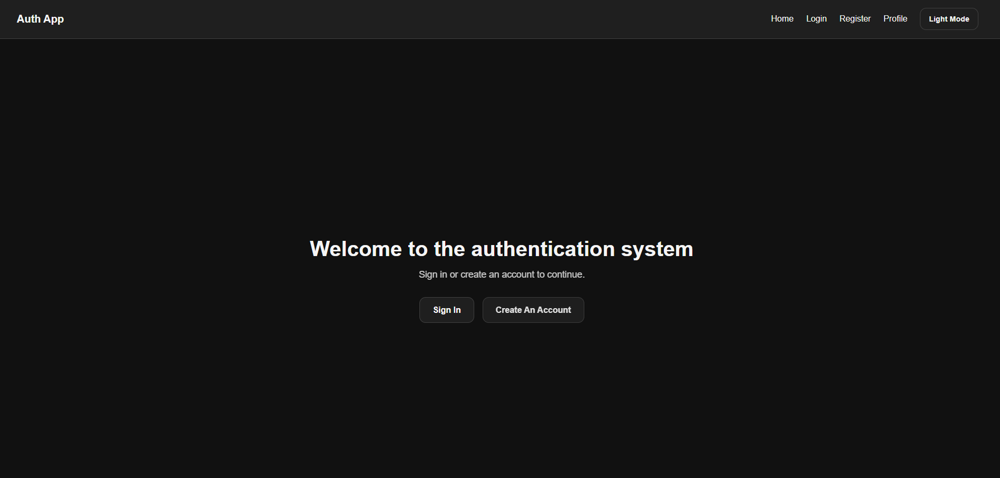
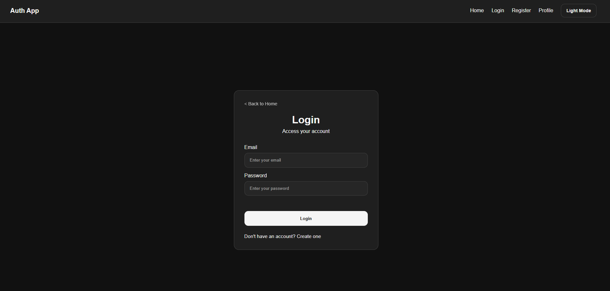
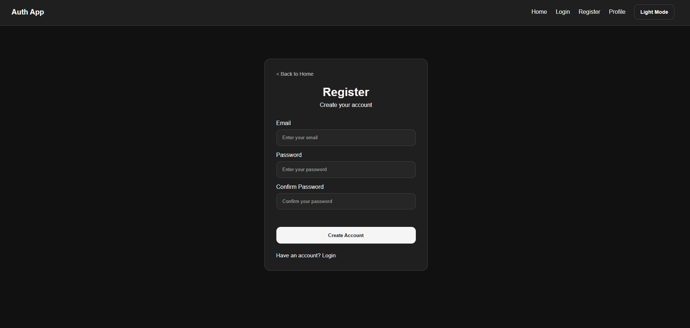
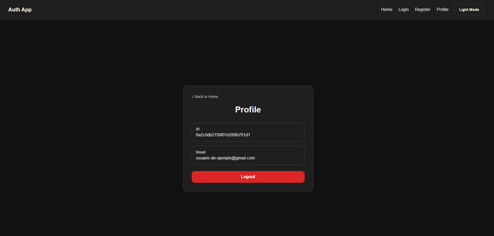

# Fullstack Authentication System

A full-stack authentication system built with React, Node.js, Express, MongoDB, JWT, and HTTP-only cookies.

This project was created to learn and practice the complete authentication flow used in modern web applications, including user registration, login, protected routes, profile access, and logout functionality.

## Live Demo

Frontend:
https://auth-system-fullstack.vercel.app

Backend:
https://auth-system-8en4.onrender.com

---

## Features

* User Registration
* User Login
* JWT Authentication
* HTTP-only Cookies
* Protected Routes
* User Profile Page
* Logout Functionality
* Dark / Light Theme
* Form Validation
* Responsive Design

---

## Security Features

* Password hashing with bcrypt
* JWT authentication
* HTTP-only cookies
* Protected backend routes
* Server-side token validation
* Secure logout process
* Environment variables for sensitive data

---

## Screenshots

### Home



### Login



### Register



### Profile



---

## Tech Stack

### Frontend

* React
* React Router DOM
* Sass (SCSS)
* Vite

### Backend

* Node.js
* Express.js
* MongoDB Atlas
* Mongoose
* JWT (JSON Web Tokens)
* bcrypt

---

## API Endpoints

| Method | Endpoint           | Description                    |
| ------ | ------------------ | ------------------------------ |
| POST   | /api/auth/register | Register a new user            |
| POST   | /api/auth/login    | Authenticate user              |
| GET    | /api/auth/profile  | Get authenticated user profile |
| POST   | /api/auth/logout   | Logout user                    |

---

## Project Structure

```text
auth-system/
├── front-end/
│   ├── src/
│   │   ├── components/
│   │   │   ├── auth/
│   │   │   ├── routes/
│   │   │   └── ui/
│   │   ├── layouts/
│   │   ├── pages/
│   │   ├── routes/
│   │   ├── services/
│   │   ├── styles/
│   │   └── utils/
│   └── ...
│
└── backend/
    ├── controllers/
    ├── middlewares/
    ├── models/
    ├── routes/
    ├── index.js
    └── ...
```

---

## Authentication Flow

### Registration

```text
Register
↓
Validate data
↓
Hash password
↓
Store user in MongoDB
```

### Login

```text
Login
↓
Validate credentials
↓
Generate JWT
↓
Store JWT in HTTP-only cookie
```

### Protected Route

```text
ProtectedRoute
↓
Request user profile
↓
JWT validation
↓
Allow or deny access
```

### Logout

```text
Logout
↓
Clear authentication cookie
↓
Redirect user
```

---

## Environment Variables

### Frontend

Create a `.env` file inside `front-end`:

```env
VITE_API_URL=http://localhost:5000
```

### Backend

Create a `.env` file inside `backend`:

```env
MONGO_URI=your_mongodb_connection_string
JWT_SECRET=your_jwt_secret
NODE_ENV=development
PORT=5000
```

---

## Installation

### Clone Repository

```bash
git clone https://github.com/NicAT-12/fullstack-auth-system.git
```

### Backend

```bash
cd backend

pnpm install

pnpm start
```

### Frontend

```bash
cd front-end

pnpm install

pnpm dev
```

---

## What I Learned

Through this project I practiced and reinforced several full-stack development concepts:

* Building REST APIs with Express
* Working with MongoDB and Mongoose
* Password hashing with bcrypt
* JWT authentication
* Managing authentication with HTTP-only cookies
* Protecting routes in React
* React Router navigation and redirects
* Form validation on both frontend and backend
* Environment variable management
* Organizing scalable project structures
* Creating reusable React components
* Implementing responsive layouts with Sass
* Managing application themes (Light/Dark Mode)
* Deploying a full-stack application with Vercel and Render
* Configuring CORS between different domains
* Managing authentication cookies across production environments

---

## Future Improvements

* Authentication Context
* Refresh Tokens
* Email Verification
* Password Recovery
* User Roles and Permissions
* Better Error Handling

---

## Author

Developed by Nicolas Torres

GitHub:
https://github.com/NicAT-12

LinkedIn:
www.linkedin.com/in/nicolas-tissoni-
